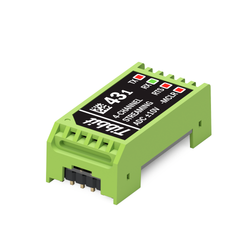

# Tibbit #43-1

## Introduction

This repository contains the firmware for the PIC16F1825 microcontroller integrated into Tibbit #43-1 Four-Channel Streaming ADC ±10V. The microcontroller enables low-jitter sampling of analog data while enhancing the linearity and precision of analog-to-digital conversions. Upgrades to the microcontroller's firmware will be made available here as they are released, and customers are welcome to submit their improvements to the code.

Tibbit #43-1 is based on the AD7323 12-bit+sign successive-approximation analog-to-digital converter IC. It offers four single-ended or two differential channels. In the differential mode, the data streams of two AC signals can be sampled for digital signal processing operations, such as phase detection and power quality factor calculations. However, special care must be taken, as this is not an isolated Tibbit.

Tibbit #43-1 has an input range of ±10V in the single-ended mode and ±20V in the differential mode. Both are common output ranges of industrial pressure, temperature, and other types of transducers. This makes Tibbit #43-1 ideal for use in Internet of Things (IoT), Industrial IoT (IIoT), and industrial automation applications that require continuous sampling of instruments and on-the-fly analog-to-digital conversion of the data.

  

  

## Developer's Guide

The pin assignments of Tibbit #43-1 are illustrated in the following diagram:

  

The files in this repo were designed to work with the MPLAB X integrated development environment and the MPLAB XC8 PRO compiler.

Most operations, including math and signal conditioning, are performed in `operate.c`.
Parsing mechanisms and the command sequence are contained in `command.c`.
All components related to microchip drivers and peripherals are located inisde the `mcc_generated_files` folder.

## Firmware Upgrades

The microcontroller's firmware can be upgraded in the system without any external hardware. Firmware updates take place through the microcontroller's low-voltage programming (LVP) mode. The Tibbit's TX line acts as ICSPCLK, the RX line as ICSPDAT, and the –MCLR line puts the microcontroller into the LVP mode.

For more information on LVP, please see [this resource](https://microchipdeveloper.com/8bit:lvp).

## Application Notes

There is a wide range of analog output transmitters and sensors used in industrial automation, process control, and data acquisition (DAQ) systems.
These devices — such as water level sensors and industrial-grade resistance temperature detectors (RTDs) — usually have analog output of 0–5V or 0–10V.
Some of these transmitters output a linear waveform of changes that should be polled at a specific sampling rate and with high precision.
Examples of these devices include:
* PT100/PT1000 temperature transmitters
* Pressure transmitters
* Load cell transmitters
* Automotive fuel temperature sensors
* Solar radiation sensors (pyranometers)
* CO2 sensors

Tibbit #43-1 — developed and manufactured by Tibbo Technology Inc. — is a robust solution for industrial environments. It features a user-friendly and reliable command interface implemented over UART.
When combined with the [Tibbo Project System (TPS)](https://tibbo.com/store/tps.html) — particulary the [Size 3 Linux Tibbo Project PCB, Gen. 2](https://tibbo.com/store/tps/ltpp3g2.html) — Tibbit #43-1 can be used to realize a wide range of IoT, IIoT, and process control and monitoring solutions for a wide range of Industry 4.0 applications.
The combination of this Tibbit and the TPS makes sensor-to-cloud, remote I/O, and IIoT deployments robust, user-friendly, and cost-effective.

As a member of the TPS platform, Tibbit #43-1 is fully supported by the [CODY project code generator](https://cody.tibbo.com), as well as Tibbo's dedicated support team. CODY accelerates the development of your IoT solutions by creating a framework for your project that uses Tibbo's best practices and reduces the amount of time you spend coding.

## Useful links
* [Tibbit #43-1 — Official Product Page](https://www.tibbo.com/store/tps/tibbits.html#/?filter=%2343_1)
* [Tibbit #43-1 — Official Documentation](https://docs.tibbo.com/phm/tibbit_43-1)
* [Tibbit #43-1 Interface Protocol Documentation](https://docs.tibbo.com/phm/tibbit_43-1_interface)
* [CODY — Tibbo's Project Code Wizard](https://cody.tibbo.com)
* [Contact Tibbo Support](https://tibbo.com/support/contact.html)
